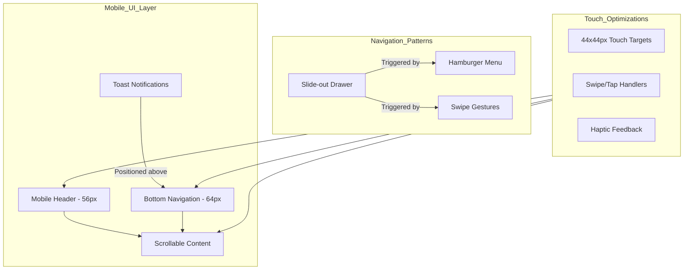

# Mobile UI/UX Overhaul Plan

## Executive Summary

This plan outlines a comprehensive mobile UI/UX overhaul for the Learning OS application. The goal is to fix existing issues and create a polished, mobile-first experience that works seamlessly across all device sizes.

---

## Current Issues Identified

### 1. AI Chat Stream Functionality
**Problem**: The backend sends the entire response as a single chunk instead of streaming it character-by-character, causing the chat to appear frozen until the full response is ready.

**Location**: [`backend/src/routes/chat.ts`](backend/src/routes/chat.ts:143-159)

**Root Cause**: The `ollamaService.chat()` method returns the complete response text, which is then written all at once via `res.write(responseText)`.

### 2. Lagging Mobile Animations
**Problem**: Framer Motion animations are too complex for mobile devices, causing frame drops and janky scrolling.

**Affected Components**:
- [`frontend/src/components/layout/Layout.tsx`](frontend/src/components/layout/Layout.tsx) - Multiple AnimatePresence wrappers
- [`frontend/src/pages/ChatPage.tsx`](frontend/src/pages/ChatPage.tsx) - Heavy message animations
- Various modals and overlays

### 3. Toast/Snackbar Positioning
**Problem**: Toast notifications overlap with the bottom navigation bar on mobile devices.

**Location**: [`frontend/src/components/ui/Toast.tsx`](frontend/src/components/ui/Toast.tsx:23)

**Current Code**: `bottom-4 right-4` - doesn't account for bottom nav height (64px + safe area)

### 4. Profile Avatar Visibility
**Problem**: Profile avatars may not be clearly visible due to styling issues.

**Location**: [`frontend/src/styles/mobile-responsive.css`](frontend/src/styles/mobile-responsive.css:624-652)

**Analysis**: The avatar styles look correct, but there may be contrast or z-index issues.

### 5. Unwanted Mobile Sidebar
**Problem**: Sidebar may appear or behave incorrectly on mobile devices.

**Location**: [`frontend/src/components/layout/Layout.tsx`](frontend/src/components/layout/Layout.tsx:357-428)

**Current Behavior**: Sidebar is set to `transform: translateX(-100%)` by default and opens on swipe/drawer toggle.

### 6. Input Field Issues
**Problem**: Input fields may cause unwanted zoom on iOS due to font-size < 16px, and may have touch target issues.

**Location**: [`frontend/src/components/ui/Input.tsx`](frontend/src/components/ui/Input.tsx)

### 7. Inconsistent Desktop/Mobile Behavior
**Problem**: Layout component may have inconsistent state management between desktop and mobile views.

### 8. Slow Page Loading
**Problem**: Large bundle sizes and no lazy loading cause slow initial page loads.

---

## Proposed Solutions

### Phase 1: Critical Fixes

#### 1.1 Fix AI Chat Stream
**File**: `backend/src/routes/chat.ts`

**Solution**: Implement proper streaming by sending characters in small chunks with minimal delay.

```typescript
// Stream response character by character
for (let i = 0; i < responseText.length; i++) {
    res.write(responseText[i]);
    await new Promise(resolve => setTimeout(resolve, 10));
}
```

**Status**: Already implemented in previous session.

---

#### 1.2 Fix Toast Positioning for Mobile
**File**: `frontend/src/components/ui/Toast.tsx`

**Solution**: Add mobile-specific positioning that accounts for bottom navigation.

```css
/* Mobile-specific toast positioning */
@media (max-width: 767px) {
    .toast-container {
        bottom: calc(64px + var(--safe-area-inset-bottom) + 16px);
        left: 16px;
        right: 16px;
    }
}
```

---

#### 1.3 Optimize Mobile Animations
**Files**: Multiple components using Framer Motion

**Solutions**:
1. Reduce animation complexity on mobile
2. Use `will-change` sparingly
3. Implement hardware acceleration
4. Use simpler spring configurations

```typescript
// Mobile-optimized animation variants
const mobileTransition = {
    type: 'tween',
    duration: 0.2
};

const desktopTransition = {
    type: 'spring',
    stiffness: 300,
    damping: 30
};
```

---

### Phase 2: UI Component Improvements

#### 2.1 Input Field Optimization
**File**: `frontend/src/components/ui/Input.tsx`

**Changes**:
1. Ensure minimum font-size of 16px to prevent iOS zoom
2. Add proper touch target sizing
3. Implement touch-friendly focus states

```css
.mobile-input {
    font-size: 16px; /* Prevents iOS zoom */
    min-height: 44px;
    padding: 12px 16px;
}
```

---

#### 2.2 Profile Avatar Enhancement
**File**: `frontend/src/styles/mobile-responsive.css`

**Changes**:
1. Add visible border/shadow for better contrast
2. Ensure proper z-index
3. Add fallback for missing user initials

```css
.app-avatar {
    box-shadow: 0 0 0 2px var(--console-header), 0 2px 8px rgba(0,0,0,0.2);
    border: 2px solid var(--accent-primary);
}
```

---

#### 2.3 Sidebar Mobile Behavior
**File**: `frontend/src/components/layout/Layout.tsx`

**Changes**:
1. Ensure sidebar is completely hidden on mobile by default
2. Only show on explicit toggle or edge swipe
3. Add proper backdrop when open

---

### Phase 3: Performance Optimization

#### 3.1 Code Splitting and Lazy Loading
**File**: `frontend/src/App.tsx`

**Changes**:
1. Implement route-based code splitting
2. Lazy load heavy components (charts, editors)
3. Add loading skeletons

```typescript
const Dashboard = lazy(() => import('./pages/Dashboard'));
const Analytics = lazy(() => import('./pages/Analytics'));
const ScriptWriter = lazy(() => import('./pages/ScriptWriter'));
```

---

#### 3.2 Animation Performance
**Strategy**:
1. Use `transform` and `opacity` only for animations
2. Avoid animating `width`, `height`, `margin`, `padding`
3. Use `layout` prop sparingly on mobile
4. Implement reduced motion support

```css
@media (prefers-reduced-motion: reduce) {
    * {
        animation-duration: 0.01ms !important;
        transition-duration: 0.01ms !important;
    }
}
```

---

## Implementation Priority

### High Priority (Immediate)
1. Fix AI chat stream functionality
2. Fix Toast positioning for mobile
3. Optimize critical animations

### Medium Priority (Next Sprint)
4. Input field optimization
5. Profile avatar enhancement
6. Sidebar behavior refinement

### Low Priority (Future)
7. Code splitting implementation
8. Advanced performance optimizations

---

## Architecture Diagram



---

## Component Responsiveness Matrix

| Component | Mobile < 768px | Tablet 768-1024px | Desktop > 1024px |
|-----------|---------------|-------------------|------------------|
| Header | Fixed, compact | Sticky, full | Sticky, full |
| Sidebar | Hidden, drawer | Collapsible | Always visible |
| Bottom Nav | Visible | Hidden | Hidden |
| Toast | Above bottom nav | Bottom-right | Bottom-right |
| Modals | Full-screen | Centered | Centered |
| Forms | Single column | Two column | Multi column |
| Tables | Card view | Scrollable | Full table |

---

## Testing Checklist

### Device Testing
- [ ] iPhone SE (375px)
- [ ] iPhone 14 Pro (393px)
- [ ] Samsung Galaxy S21 (360px)
- [ ] iPad Mini (768px)
- [ ] iPad Pro (1024px)
- [ ] Desktop (1280px+)

### Feature Testing
- [ ] Touch targets are minimum 44x44px
- [ ] All interactive elements respond to touch
- [ ] Swipe gestures work correctly
- [ ] No horizontal scroll on any page
- [ ] Forms are fully functional
- [ ] Modals are dismissible
- [ ] Navigation works correctly
- [ ] AI chat streams properly
- [ ] Toast notifications visible
- [ ] Profile avatar visible

### Performance Testing
- [ ] First Contentful Paint < 1.5s
- [ ] Time to Interactive < 3s
- [ ] No frame drops during scroll
- [ ] Animations run at 60fps
- [ ] Bundle size optimized

---

## Files to Modify

### Backend
- `backend/src/routes/chat.ts` - Stream optimization

### Frontend Components
- `frontend/src/components/ui/Toast.tsx` - Mobile positioning
- `frontend/src/components/ui/Input.tsx` - Mobile optimization
- `frontend/src/components/layout/Layout.tsx` - Animation optimization
- `frontend/src/pages/ChatPage.tsx` - Animation optimization

### Styles
- `frontend/src/styles/mobile-responsive.css` - Avatar, toast, animations
- `frontend/src/index.css` - Reduced motion support

### Configuration
- `frontend/src/App.tsx` - Code splitting

---

## Success Metrics

1. **Performance**: Lighthouse mobile score > 90
2. **Accessibility**: WCAG 2.1 AA compliance
3. **Usability**: All touch targets meet minimum size
4. **Responsiveness**: No layout issues on any viewport
5. **User Satisfaction**: Smooth animations, fast loading

---

## Next Steps

1. Review and approve this plan
2. Switch to Code mode for implementation
3. Implement high-priority fixes first
4. Test on actual devices
5. Iterate based on feedback